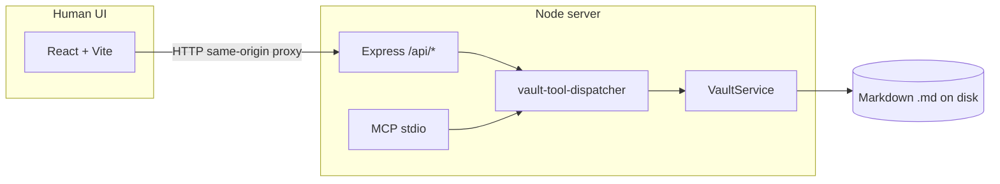

# NoteVault

Local-first markdown vault (Obsidian-style) with a **shared vault layer** used by:

1. A **React + Vite** web UI (HTTP API)
2. An **MCP** stdio server for agents (Claude Desktop, Cursor, or any MCP client)

MIT licensed. This repo includes a **seed vault** under `seed-vault/` (10 core interlinked notes plus optional extras — see **Seed vault** below).

[](https://github.com/alisoliman-47/notevault/actions/workflows/ci.yml)


| Requirement | Where it lives |
|-------------|----------------|
| **Public or invited GitHub repo** + **MIT or Apache-2.0** | **Repo:** [github.com/alisoliman-47/notevault](https://github.com/alisoliman-47/notevault). [LICENSE](./LICENSE) is **MIT** (Apache-2.0 would also satisfy the brief). To recreate elsewhere: `brew install gh`, `gh auth login`, then **`./scripts/create-github-repo.sh`** (optional repo name argument). |
| **README:** setup, architecture sketch, **BYO-agent snippet**, cuts, broken, next | This file — sections **Setup**, **Architecture**, **BYO agent snippet**, **What was cut**, **What is currently rough / broken**, **What would be built next**. |
| **Seed vault** (~10 interlinked sample notes, committed) | Folder [`seed-vault/`](./seed-vault/) — hub is `Start Here.md`. |
| **Demo video** (15–20 min) | Not in-repo; record separately (e.g. Loom) using **Demo checklist** below. |
| **Tests + CI (extra)** | **`npm test`** — Vitest on the server (`paths`, tool catalog, dispatcher + temp vault). [`.github/workflows/ci.yml`](./.github/workflows/ci.yml) runs **`npm ci` → `npm run build` → `npm test`** on every push and PR. |

## Setup

Requirements: **Node.js 20+** and npm.

```bash
cd knowidea
npm install
npm run dev
```

- API + MCP code: `http://127.0.0.1:8787` (Express)
- UI: `http://127.0.0.1:5173` (Vite)
- **Health:** `GET http://127.0.0.1:8787/api/health` returns JSON `{ ok, service, vault: { open, root } }` (no disk I/O; safe for load balancers).
- **Verify before submit:** `npm run build && npm test`

In the UI top bar, paste the **absolute path** to a folder (try the repo’s `seed-vault`) and click **Open**.

> **Why paste a path?** A browser cannot expose a real filesystem path from a folder picker to your local Node server. For a packaged desktop app, swap this for Tauri/Electron folder selection and the same `VaultService` still applies.

### MCP (Claude Desktop example)

Point MCP at **`server/mcp-launch.js`** (not `dist/mcp-stdio.js` directly). The launcher rebuilds when any `server/src/**/*.ts` is newer than `dist/mcp-stdio.js`, so you never run stale MCP code after pulling or editing.

```bash
npm install
```

`~/Library/Application Support/Claude/claude_desktop_config.json` (macOS) — add:

```json
{
  "mcpServers": {
    "notevault": {
      "command": "node",
      "args": ["/ABS/PATH/TO/knowidea/server/mcp-launch.js"],
      "env": {
        "NOTEVAULT_ROOT": "/ABS/PATH/TO/knowidea/seed-vault"
      }
    }
  }
}
```

(Optional) Add **`"NOTEVAULT_MCP_MODE": "readonly"`** next to `NOTEVAULT_ROOT` under `env` to lock MCP to reads — see **Nice-to-have: read-only MCP** below.

Restart Claude Desktop. Ask it to call `list_notes`, then `read_note` on `Start Here.md`, then `update_note` with `mode: "append"` so it **reads**, **writes**, and **adds a `[[wiki link]]`** in one session — that satisfies the “agent demo” bar.

### Agent demo — Option B (in-repo LLM + MCP)

This repo ships `server/src/agent-demo.ts`: an MCP **client** that spawns `server/mcp-launch.js` and drives the same six tools via **Anthropic** or **OpenAI** (your API key).

```bash
npm run build -w server
export NOTEVAULT_ROOT="/ABS/PATH/knowidea/seed-vault"
export ANTHROPIC_API_KEY="..."   # or OPENAI_API_KEY
npm run agent-demo -w server
```

Optional: `export AGENT_TASK="..."` to override the default goal. Models default to `claude-3-5-haiku-20241022` / `gpt-4o-mini` (`ANTHROPIC_MODEL` / `OPENAI_MODEL` override).

**MCP wiring only (no API key):** after `npm run build -w server`,

```bash
NOTEVAULT_ROOT="/ABS/PATH/knowidea/seed-vault" npm run agent-demo -w server -- --smoke
```

runs `list_notes` → `read_note` → `create_note` with a `[[Start Here]]` link (then deletes nothing automatically; remove the generated `Agent/.agent-demo-*.md` if you want a clean tree).

### BYO agent snippet (~20 lines)

**Bring-your-own agent:** any MCP client can attach the same way Claude Desktop does. NoteVault exposes the vault only through **MCP stdio**: spawn `node …/server/mcp-launch.js` (auto-rebuilds when needed) or `node …/server/dist/mcp-stdio.js` after a manual `npm run build -w server`, with env **`NOTEVAULT_ROOT`** pointing at a folder of `.md` files. Install `@modelcontextprotocol/sdk` in your agent project (or reuse this repo’s `server` package). Any MCP-capable host uses the same contract — no second API.

```typescript
import { Client } from "@modelcontextprotocol/sdk/client";
import { StdioClientTransport } from "@modelcontextprotocol/sdk/client/stdio.js";

const MCP_JS = "/ABS/PATH/knowidea/server/mcp-launch.js";
const VAULT = "/ABS/PATH/knowidea/seed-vault";
const transport = new StdioClientTransport({
  command: "node",
  args: [MCP_JS],
  env: { ...process.env, NOTEVAULT_ROOT: VAULT },
});
const client = new Client({ name: "my-agent", version: "1.0.0" }, { capabilities: {} });
await client.connect(transport);
try {
  const { tools } = await client.listTools();
  const out = await client.callTool({
    name: "read_note",
    arguments: { path: "Start Here.md" },
  });
  console.log(tools?.map((t) => t.name), out);
} finally {
  await client.close();
}
```

Swap `MCP_JS` / `VAULT` for your paths; tool names and shapes match the table in **MCP tools implemented** below.

## Architecture



- **Single source of truth:** `server/src/vault/vault-service.ts` implements list/read/create/update/delete, search, backlinks, and wiki open-or-create.
- **HTTP** (`server/src/http-app.ts`) and **MCP** (`server/src/mcp-stdio.ts`, usually started via `server/mcp-launch.js`) both go through **`server/src/vault-tool-dispatcher.ts`**: the six brief tools map 1:1 to `dispatchVaultTool` cases. The UI-only routes **DELETE `/api/note`** and **POST `/api/wiki/open`** use the same dispatcher (`delete_note` / `open_wiki`). The only other `VaultService` call from Express is **`setRoot`** on **POST `/api/vault`** (folder bootstrap; not an MCP tool).
- **MCP protocol:** tool `inputSchema` values are Zod objects with `.min(1)` on paths and `.describe()` on fields so generated JSON Schema is explicit for agents. Tool failures use `isError` text; read-only mode returns messages prefixed with **`[READONLY_MCP]`** for easy handling.
- **Agents:** point MCP hosts at **`mcp-launch.js`** so `dist/` is rebuilt when `src/` changes (see MCP section above).
- **Regression safety:** automated tests under `server/src/**/*.test.ts` (Vitest); GitHub Actions CI on push/PR (see checklist table).

## Seed vault

Committed under [`seed-vault/`](./seed-vault/). Open **`Start Here.md`** in the UI for a hub with outbound `[[wiki links]]` to the other sample notes (about **10** core pages: projects, concepts, people, journal, research, inbox, archive). **`Inbox/MCP Notes.md`** is an extra short note that links into the graph. Use this folder as `NOTEVAULT_ROOT` for demos without authoring data first.

## MCP tools implemented

| Tool | Maps to |
|------|---------|
| `list_notes` | `listNotes()` |
| `read_note` | `readNote()` |
| `create_note` | `createNote()` |
| `update_note` | `updateNote()` |
| `search_notes` | `searchNotes()` |
| `list_backlinks` | `listBacklinks()` |

### Nice-to-have: read-only MCP (pick at most one — implemented here)

Sets **`NOTEVAULT_MCP_MODE=readonly`** on the MCP server process only (e.g. in Claude Desktop’s `mcpServers.notevault.env` alongside `NOTEVAULT_ROOT`). Tools **`create_note`** and **`update_note`** then return clear errors; **`list_notes`**, **`read_note`**, **`search_notes`**, and **`list_backlinks`** behave as usual. **HTTP API / web UI stays read-write** so humans are not blocked.

Use **`server/mcp-launch.js`** as the MCP entry (see above) so `dist/` is rebuilt after edits; otherwise Claude can keep running an old `mcp-stdio.js` and ignore new flags like read-only.

## Human UI (assignment scope)

- Open vault by absolute path, sidebar file list, markdown editor + live preview
- Preview uses **GitHub-flavored Markdown** (tables, task lists, strikethrough, etc.) via `remark-gfm`, with custom handling so `[[Wiki links]]` still resolve as `wiki:` links in the preview
- `[[Wiki links]]` in preview (click opens or creates stub)
- Backlinks panel for the active note
- **⌘/Ctrl+P** search palette (full-text), **⌘/Ctrl+S** save
- Basic **accessibility**: landmark roles/labels, list semantics for the note list, keyboard **Enter** / **Space** on notes and backlinks, labeled editor and command palette
- **`prefers-reduced-motion`**: palette entrance animation and short UI transitions are toned down when the OS requests reduced motion
- Explicitly **not** built: graph view, tags, themes

The browser client (`client/src/api.ts`) surfaces HTTP error bodies even when the response is not JSON (plain text or HTML), so failed opens/saves are easier to debug.

## What was cut (and why)

- **Desktop shell (Tauri/Electron):** time-boxed to “boring” Vite + Node; path picker deferred (see README honesty above).
- **SQLite FTS:** simple in-memory scan over files is enough for the demo vault; easy upgrade later.
- **Optional “nice to haves” (pick ≤1):** **read-only MCP mode** (`NOTEVAULT_MCP_MODE=readonly`); others (graph view, embeddings search, undo log) not implemented.

## What is currently rough / broken

- **Ambiguous wiki titles:** if two notes share the same filename in different folders, wiki resolution may be wrong; Obsidian-style uniqueness is not fully modeled.
- **Large vaults:** search/backlinks re-read files eagerly; no watcher-based incremental index yet.
- **No auth** on HTTP API: bind to localhost only for local use.

## What would be built next

- Tauri wrapper + native folder picker, single packaged app
- SQLite FTS5 or persistent index + debounced rebuild
- Graph view (d3-force / cytoscape), embeddings-based semantic MCP search, or agent write log + undo — not started

## Demo video (15–20 min)

Not stored in git. Record with **Loom**, **QuickTime**, or similar: follow **Demo checklist** below; show **human UI** on `seed-vault`, then **agent** (Claude Desktop or `npm run agent-demo -w server`), then a short **code** segment (`vault-tool-dispatcher.ts`, `mcp-stdio.ts`, `VaultService`).

## Demo checklist (15–20 min)

Follow the employer’s timeline: intro → human UI on `seed-vault` → **agent demo (centerpiece)** → code walkthrough of `VaultService` + MCP wiring → cuts / broken / next.

## License

This project uses the **MIT License** — see [LICENSE](./LICENSE). (The brief also allows **Apache-2.0**; either is fine for submission.)
