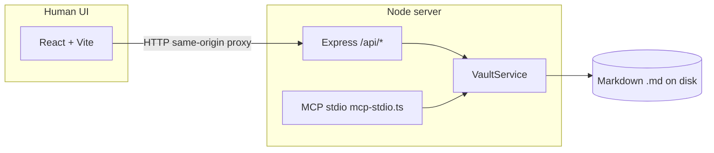

# NoteVault

Local-first markdown vault (Obsidian-style) with a **shared vault layer** used by:

1. A **React + Vite** web UI (HTTP API)
2. An **MCP** stdio server for agents (Claude Desktop, Cursor, or any MCP client)

MIT licensed. This repo includes a **seed vault** under `seed-vault/` (~10 interlinked notes).

## Setup

Requirements: **Node.js 20+** and npm.

```bash
cd knowidea
npm install
npm run dev
```

- API + MCP code: `http://127.0.0.1:8787` (Express)
- UI: `http://127.0.0.1:5173` (Vite)

In the UI top bar, paste the **absolute path** to a folder (try the repo’s `seed-vault`) and click **Open**.

> **Why paste a path?** A browser cannot expose a real filesystem path from a folder picker to your local Node server. For a packaged desktop app, swap this for Tauri/Electron folder selection and the same `VaultService` still applies.

### MCP (Claude Desktop example)

Build the server once, then point MCP at the compiled entry (or use `npm run mcp:dev` with `tsx`).

```bash
npm run build -w server
```

`~/Library/Application Support/Claude/claude_desktop_config.json` (macOS) — add:

```json
{
  "mcpServers": {
    "notevault": {
      "command": "node",
      "args": ["/ABS/PATH/TO/knowidea/server/dist/mcp-stdio.js"],
      "env": {
        "NOTEVAULT_ROOT": "/ABS/PATH/TO/knowidea/seed-vault"
      }
    }
  }
}
```

Restart Claude Desktop. Ask it to call `list_notes`, then `read_note` on `Start Here.md`, then `update_note` with `mode: "append"`.

### Bring-your-own agent (~20 lines)

Any MCP-capable client can spawn the same process. Pseudocode using the official **TypeScript MCP client** pattern:

```typescript
import { Client } from "@modelcontextprotocol/sdk/client";
import { StdioClientTransport } from "@modelcontextprotocol/sdk/client/stdio.js";

const transport = new StdioClientTransport({
  command: "node",
  args: ["/ABS/PATH/knowidea/server/dist/mcp-stdio.js"],
  env: { ...process.env, NOTEVAULT_ROOT: "/ABS/PATH/knowidea/seed-vault" },
});
const client = new Client({ name: "demo", version: "0.0.1" }, { capabilities: {} });
await client.connect(transport);
const tools = await client.listTools();
const result = await client.callTool({ name: "search_notes", arguments: { query: "MCP", limit: 5 } });
console.log(result);
await client.close();
```

Point `NOTEVAULT_ROOT` at the vault you want the agent to read/write.

## Architecture



- **Single source of truth:** `server/src/vault/vault-service.ts` implements list/read/create/update/delete, search, backlinks, and wiki open-or-create.
- **HTTP** (`server/src/http-app.ts`) maps REST-style routes to `VaultService`.
- **MCP** (`server/src/mcp-stdio.ts`) registers required tools and calls the same methods.

## MCP tools implemented

| Tool | Maps to |
|------|---------|
| `list_notes` | `listNotes()` |
| `read_note` | `readNote()` |
| `create_note` | `createNote()` |
| `update_note` | `updateNote()` |
| `search_notes` | `searchNotes()` |
| `list_backlinks` | `listBacklinks()` |

## Human UI (assignment scope)

- Open vault by absolute path, sidebar file list, markdown editor + live preview
- `[[Wiki links]]` in preview (click opens or creates stub)
- Backlinks panel for the active note
- **⌘/Ctrl+P** search palette (full-text)
- **⌘/Ctrl+S** save
- Explicitly **not** built: graph view, tags, themes

## What was cut (and why)

- **Desktop shell (Tauri/Electron):** time-boxed to “boring” Vite + Node; path picker deferred (see README honesty above).
- **SQLite FTS:** simple in-memory scan over files is enough for the demo vault; easy upgrade later.
- **Optional “nice to haves”:** none selected (per “pick at most one”).

## What is currently rough / broken

- **Ambiguous wiki titles:** if two notes share the same filename in different folders, wiki resolution may be wrong; Obsidian-style uniqueness is not fully modeled.
- **Large vaults:** search/backlinks re-read files eagerly; no watcher-based incremental index yet.
- **No auth** on HTTP API: bind to localhost only for local use.

## What would be built next

- Tauri wrapper + native folder picker, single packaged app
- SQLite FTS5 or persistent index + debounced rebuild
- Optional read-only MCP mode (from the rubric’s “nice to have” list)

## Demo checklist (15–20 min)

Follow the employer’s timeline: intro → human UI on `seed-vault` → **agent demo (centerpiece)** → code walkthrough of `VaultService` + MCP wiring → cuts / broken / next.

## License

See [LICENSE](./LICENSE).
